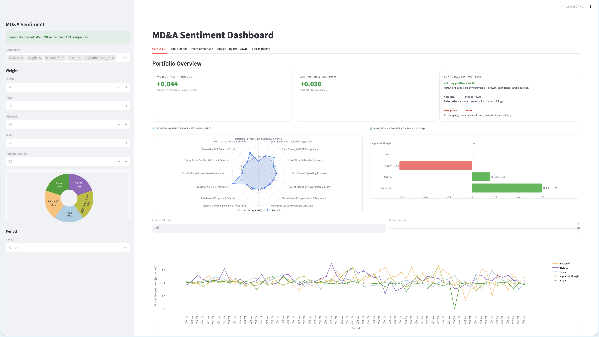

# Financial NLP: SEC MD&A Sentiment & Topic Analysis

NLP pipeline for analysing Management Discussion & Analysis (MD&A) sections from SEC 10-K/10-Q filings — covering sentiment classification and topic modelling across 473 technology companies (2010–2025).

---

## Folder Overview

| Folder                | Description                                                                                  |
| --------------------- | -------------------------------------------------------------------------------------------- |
| `data_preparation/`   | Cleans raw MD&A `.txt` files, segments into sentences, outputs `mda_shared_preprocessed.csv` |
| `sentiment_analysis/` | Labels sentences, fine-tunes FinBERT, and runs rule-based / Naive Bayes baselines            |
| `topic_modeling/`     | LDA and BERTopic models on filing-level MD&A text                                            |
| `datasets/`           | Raw MD&A files (`raw_mda/`), processed CSVs (`final/`), and labeling artefacts (`interim/`)  |
| `webapp/`             | Streamlit dashboard — merges sentiment + topic outputs and visualises trends                 |

---

## Sentiment Analysis Results

| Model                  | Positive F1 | Neutral F1 | Negative F1 | Macro F1 |
| ---------------------- | ----------- | ---------- | ----------- | -------- |
| Rule-based (Custom LM) | 0.25        | 0.76       | 0.23        | 0.41     |
| Naive Bayes            | 0.56        | 0.93       | 0.54        | 0.68     |
| FinBERT (fine-tuned)   | 0.87        | 0.98       | 0.85        | **0.90** |

---

## Topic Modeling Results

| Model       | Coherence (C_v) | Log Perplexity |
| ----------- | --------------- | -------------- |
| sklearn LDA | —               | 1984           |
| Gensim LDA  | 0.5719          | -7.96          |
| BERTopic    | **0.6374**      | —              |

---

## Web App Setup

The dashboard reads a pre-built `webapp/final_df.parquet` — no model re-training needed.

```bash
# Install dependencies
pip install -r webapp/requirements.txt

# Run
streamlit run webapp/app.py
```

> To rebuild `final_df.parquet` from scratch, run `webapp/final_data.ipynb` after completing the sentiment and topic modeling steps.

---

## Screenshot


